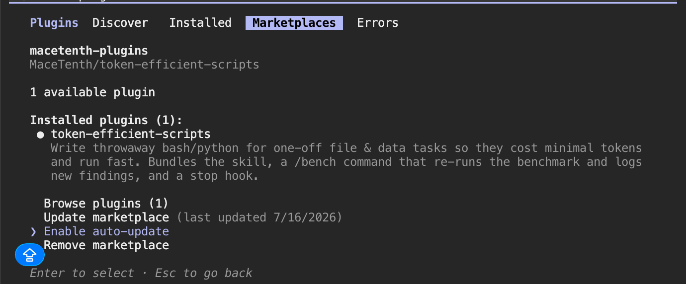

<div align="center">

# ⚡ token-efficient-scripts

**A Claude Code plugin for throwaway bash/python that costs almost nothing.**


**[🎞️ View the interactive slide →](https://macetenth.github.io/token-efficient-scripts/slide.html)**

</div>

> For one-off shell/python that searches, counts, filters, or aggregates data, the token bill is dominated by **what the command prints back into context** — not the code. Optimize output first, data flow second, code last.

---

## The one number that matters

Same answer — *"count the 404s in a 60k-line log"* — measured as tokens returned to context:

| | command | tokens into context |
|---|---|---|
| ❌ | `grep ' 404 ' log` | **137,136** |
| ✅ | `grep -c ' 404 ' log` | **3** |

Every token a command prints is injected into context **and re-billed every turn it lingers** in an agent loop. Controlling output is the whole game.

---

## Tool selection order (decide this first)

1. **Native Claude Code tool** if one fits — **Grep** (content search), **Glob** (find files), **Read**, **Edit**, **Write**. Optimized, output-capped, and cross-platform (they work on native Windows without Git Bash, where shell `grep`/`find` don't exist). Don't shell out to `grep`/`find`/`cat`/`sed` when a native tool covers the job.
2. **Bash** for what they don't do — aggregation & transforms: `awk`, `jq`, counts, sums, group-by, multi-stage pipelines.
3. **Python** only when a one-liner can't do it cleanly.

Then apply the three tiers below to whatever you write.

## How it works — three tiers, by impact

| Tier | Lever | Billed as | Measured |
|---|---|---|---|
| **1** | **Control output** — return the answer, cap rows, project fields, spill big results to a file | input tokens | up to **~100%** |
| **2** | **Push filters early & use fast tools** — predicate pushdown, `rg`/`fd`, filter inside `jq` | runtime | **1.5–2.5×** |
| **3** | **Trim the code** — no argparse/`main()`/docstrings/try-except; shell over python | output tokens | **~25–40%** |

…all gated by correctness guardrails: `wc -l` counts newlines not lines; `cat` glues newline-less file boundaries; `sort` before `uniq`; ties ≠ bug; judge equivalence on the data, not the formatting.

---

## Benchmarks

All optimized commands were verified to return the **same answer** as their baseline. Token counts use `cl100k` (tiktoken) as a proxy — the **percentages are the robust part; absolute dollars are ±20%**.

<details open>
<summary><b>Output-token reduction across 6 tasks (99.5% combined)</b></summary>

| Task | Technique | Output naive | Output opt | Saved | Speedup |
|---|---|---:|---:|---:|---:|
| Count 404s | dump matches → return the count | 137,136 | 3 | 100% | 1.1× |
| Unique IPs w/ 500 | sort-all → **filter-then-sort** | 4 | 4 | — | **1.7×** |
| Largest files | dump all → `head -10` | 16,181 | 515 | 97% | 1.0× |
| Return 100 records | pretty JSON → **TSV rows** | 2,402 | 500 | 79% | 1.0× |
| Return 100 records | pretty JSON → compact JSON | 2,402 | 1,202 | 50% | 1.0× |
| Category summary | dump rows → aggregate to 2 lines | 299,500 | 22 | 100% | 0.9× |
| **Total** | | **457,625** | **2,246** | **99.5%** | 1.2× |

</details>

<details>
<summary><b>Refinement levers (spill-to-file, projection, tool choice)</b></summary>

| # | Technique | Metric | Result | Verdict |
|---|---|---|---|---|
| 1 | **Spill big result to file** + print summary | output tokens | 137,136 → 84 | ✅ Huge (100%) |
| 3 | **Return only needed fields** (ids vs whole objects) | output tokens | 2,402 → 400 | ✅ Strong (83%) |
| 4 | **`rg` instead of `grep`** | runtime | 2.5× faster | ✅ Strong (if `rg` installed) |
| 5 | **Pushdown into `jq`** (vs `dump\|grep\|wc`) | runtime | 1.5× faster | ✅ Good |
| 6 | **Project + filter early**, drop useless `cat`/stages | runtime | 1.2× faster | ✅ Modest but free |
| 2 | **Early `head` short-circuit** | runtime | 1.1× | ⚠️ Marginal at small scale |

</details>

<details>
<summary><b>Independent verification run — 10 experiments</b></summary>

| # | Experiment | Correct? | Output reduction | Runtime effect |
|---|---|:---:|---:|---|
| 1 | Count ERROR lines with `rg -c` | Yes | 99.999% | 1.39× faster |
| 2 | Project JSON IDs instead of records | Yes | 93.49% | 1.40× faster |
| 3 | Count JSON matches inside `jq` | Yes | 99.998% | 1.27× faster |
| 4 | Sum CSV values inside `awk` | Yes | 99.998% | 1.03× faster |
| 5 | Compact instead of pretty JSON | Yes | 40.64% | 1.21× faster |
| 6 | Cap exploratory `find` with `head` | Yes | 99.00% | 1.33× faster |
| 7 | Spill full results to a file | Yes | 99.97% | 0.61× as fast |
| 8 | Filter before sorting | Yes | no change | 1.68× faster |
| 9 | `rg -c` vs `grep -c` | Yes | no change | 6.99× faster |
| 10 | Short `awk` vs verbose Python | Yes | no change | 40% fewer code tokens, 3.29× slower |

</details>

> 📊 Full run log (append-only, updated weekly): [`benchmark-findings.md`](plugins/token-efficient-scripts/skills/token-efficient-scripts/references/benchmark-findings.md) · one-slide explainer: **[live slide](https://macetenth.github.io/token-efficient-scripts/slide.html)** ([source](slide.html))

---

## v0.6.0 — the hook that actually enforces it

Everything above is a *skill*: injected text that biases the model. It cannot stop a tool call,
so there is no guarantee an agent takes the cheap path — and plenty of reasons it won't ("read
the man page" is one of the strongest habits in the training data, and token cost is invisible
at decision time).

So v0.6.0 ships a **`PreToolUse` hook**, which the harness runs — not the model. An unfiltered
`man` is **denied**, and the denial hands back the ladder:

```
Unfiltered `man find` costs ~1,500-6,400 tokens of context and often does not
contain the answer. Recover cheapest-first instead:
1. Re-read the error you already have — BSD/macOS tools print their usage …
2. `find --help` (~58 tokens).
3. Grep the page, tightly: man find | col -b | grep -nE -m3 -B2 -A3 '<concept>' …
4. Nothing returned? The flag does not exist here — search the web (~800 tokens).
Override with `TE_ALLOW_MAN=1 man find` if you truly need the whole page.
```

Narrow by design, and it **fails open** on anything it doesn't understand — a hook that
misfires is worse than no hook:

| ❌ denied | ✅ allowed |
|---|---|
| `man find`, `man 5 hosts` | `man find \| col -b \| grep -nE -m3 -B2 -A3 'printf'` |
| `man find \| col -b`, `man x \| less` — still the whole page | `man -k compress`, `man -w find` — already tiny |
| `MANWIDTH=80 man date` | `man find > /tmp/f` — never enters context |
| | `TE_ALLOW_MAN=1 man find` — explicit override |

Verified against 18 cases: no false positives on `human`, `command -v man`, `/usr/share/man`,
or bare `man`; malformed input always allows.

**The denial costs 229 tokens** — 93% less than the average man page it replaces, and it teaches
the ladder instead of just refusing. **To disable:** remove the `PreToolUse` block from
`hooks/hooks.json`.

> ⚠️ **What a hook does and doesn't fix.** It enforces *this one habit*. The skill's other
> guidance is still only guidance, and the benchmark numbers above measure **what the efficient
> path costs, not how often a model picks it**. Adherence is unmeasured — see
> [the limitations](plugins/token-efficient-scripts/skills/token-efficient-scripts/references/cli-failure-recovery.md).

---

## New in v0.5.0 — when a command *fails*

Everything above is about writing a good command. This is about the moment one **fails** — where
the default agent reflex, *read the man page*, is the most expensive habit available.

Eight real GNU-flag-on-BSD failures (`date -d`, `stat -c`, `du --max-depth`, `grep -P`,
`xargs -d`, `sed -i`, `find -printf`, `timeout`), each measured on **tokens returned**, **whether
that text actually contains the answer**, and **wall clock**. Every fix verified correct.

### The headline, three honest ways

Same eight failures, compared like for like — the reduction depends on which pairing you quote:

| | comparison | reduction | answers |
|---|---|---:|:---:|
| **98%** | error text → `--help` → tight `man\|grep`  **vs**  reading man pages | 26,316 → **438** | 6/8 both ways |
| **97%** | tight `man\|grep`  **vs**  full `man` (the grep leg alone) | 26,316 → **870** | 6/8 both ways |
| **88%** | the full ladder incl. web  **vs**  reading man pages | 26,316 → **3,166** | 6/8 → **8/8** |

The first two rows are strict like-for-like: **same source, same answers, ~98% fewer tokens.**
The third is the one to quote when the point is correctness rather than cost — it's the only row
that solves all eight.

Three of the eight lookups cost **zero** because the answer was already in the error text, which
is a real saving but does flatter the totals. The conservative per-lookup figure is
**4,386 → 73 tokens per answer**.

### Every strategy, measured

| Recovery strategy | tokens (8 lookups) | solved | tokens per answer |
|---|---:|:---:|---:|
| the error text you already have | 392 | 3/8 | 131 |
| `cmd --help` | 464 | 4/8 | 116 |
| ❌ `man cmd` (full page) | **26,316** | 6/8 | **4,386** |
| `man cmd \| grep` (loose probe + `head`) | 3,173 | 5/8 | 635 |
| ✅ `man cmd \| grep` (tight probe, `-m3 -B2 -A3`) | **870** | 6/8 | **145** |
| web / cheatsheet, used *first* | 6,713 | 4/8 | 1,678 |

A tight grep returns **the same 6/8 answers as reading the full pages, for 1/30th of the tokens.**

### The ladder

```
error text (free) → cmd --help (~58) → tight man|grep (~150) → web, only if those return nothing
```

| ladder | tokens | solved | tool calls | wall clock |
|---|---:|:---:|:---:|---:|
| ❌ straight to `man` | 26,316 | 6/8 | 8 | 0.85s |
| error → `--help` → full `man` | 14,183 | 6/8 | 9 | 0.44s |
| error → `--help` → tight `man\|grep` | **438** | 6/8 | 9 | 0.43s |
| ✅ …then the web for what local docs lack | **3,166** | **8/8** | 11 | 0.90s |

**8.3× fewer tokens while solving two more scenarios** — ~3,290 tokens per failure down to ~400.

### What it saves — and what it doesn't

| | verdict |
|---|---|
| **Context tokens** | ✅ **the win** — 8.3× on the ladder, 30× on the man-page leg |
| **Answer rate** | ✅ **the win** — 6/8 → 8/8; two cases local docs *cannot* answer at any price |
| **Wall clock** | ⚠️ **no meaningful change** — every ladder lands within 0.43–0.90s |
| **Tool round trips** | ⚠️ **a real cost** — 1 call becomes 0–3 (3/8 need *zero*, solved from the error text) |

This is a **token and correctness** win, not a speed win. Claiming otherwise would not survive
the benchmark.

### Two traps it exposed

- **`man timeout` returns ncurses `curs_inopts(3X)`** — 2,570 tokens about `cbreak`/`noecho`,
  because Xcode's SDK ships a `timeout(3x)` C-function page (it sets curses input delay) and
  `man` resolves the name to it — while no `timeout(1)` command exists at all. Nothing is broken;
  the page is accurate and useless. Expensive *and* misleading.
- **`man X | grep … | head -N` truncates past the answer.** `%z` is defined at line 178 of
  `man stat`; a loose probe burned its 40-line window on early "format" matches. Tight probe
  with `-m3`: 55 tokens. And grep with **`-B2`** — flag names sit *above* their prose.

The division of labour is the real finding: **local docs** answer *"the flag exists, I used the
GNU spelling"*; **the web** answers *"this flag doesn't exist here at all"* — an absence no man
page states. The tight probe tells you which case you're in **for free**: on both web-only
scenarios it returned **0 tokens**, an instant escalate signal instead of 8,955 wasted ones.

> 📊 Method, full per-scenario table, and limitations: [`cli-failure-recovery.md`](plugins/token-efficient-scripts/skills/token-efficient-scripts/references/cli-failure-recovery.md) · re-run it yourself with `/token-efficient-scripts:bench-recovery`

---

## What it saves (illustrative)

An active user (~3,000 throwaway scripts/month, single-read baseline; not a universal guarantee — depends on task mix, tokenizer, caching):

| Model | Without | With | Saved |
|---|---|---|---|
| Sonnet 5 ($3/$15) | ~$54/mo | ~$3.45/mo | **~94%** |
| Opus 4.8 ($5/$25) | ~$91/mo | ~$5.75/mo | **~94%** |

In agent sessions where output lingers, the Opus saving is closer to **~$250/mo** (input re-billed each turn).

---

## Install

```
/plugin marketplace add MaceTenth/token-efficient-scripts
/plugin install token-efficient-scripts@macetenth-plugins
```

## Updating & auto-update

This plugin is under **active development** — new versions ship regularly. Update manually any time with:

```
/plugin marketplace update macetenth-plugins
/reload-plugins
```

**Recommended: enable auto-update** so you always have the latest without the manual step. In the plugin manager (`/plugin`) go to **Marketplaces → macetenth-plugins → Enable auto-update**:



Claude Code then refreshes the marketplace and updates installed plugins in the background after each session start, and prompts you to run `/reload-plugins` when a new version is ready. (Third-party marketplaces have auto-update **off by default**, so this is opt-in.)

## Use

- The **skill** activates automatically when you write a disposable script for a file/data question.
- **`/token-efficient-scripts:bench`** — re-runs the benchmark locally and appends the result to your own `${CLAUDE_PLUGIN_DATA}/findings-log.md`. It runs entirely on your machine and does **not** push anywhere.
- **`/token-efficient-scripts:bench-recovery`** — re-runs the failed-command recovery benchmark. Scenarios are prechecked, so on GNU userland it correctly reports *not applicable* rather than inventing numbers. `BENCH_NET=0` skips the network leg.

## Releasing

Maintainers: see **[RELEASING.md](RELEASING.md)** — the checklist of every file a version
touches, written from what actually broke. Gate every push on:

```
python3 plugins/token-efficient-scripts/scripts/check-release.py
```

It verifies the version agrees across `plugin.json`, `CHANGELOG.md` and the live `slide.html`,
that headline numbers match across all five files that quote them, that no reduction is rounded
up, that both test suites pass, and that the weekly task runs every benchmark without invoking
the paid `--e2e` mode.

## Self-improvement model

- Runtime findings accumulate in `${CLAUDE_PLUGIN_DATA}` (survives plugin updates).
- A finding is promoted into `SKILL.md` only when **replicated (≥2 runs) and material**; new correctness traps go in immediately.
- **Publishing to this repo is a maintainer action** — a weekly scheduled task on the maintainer's machine re-benchmarks, appends to the findings file, and pushes. Contributors benchmark locally; they don't publish here.

## Repo layout

```
.claude-plugin/marketplace.json      # marketplace manifest (macetenth-plugins)
plugins/token-efficient-scripts/     # the plugin: skill + /bench + /bench-recovery + stop hook + benchmarks
slide.html                           # one-slide explainer
```

## Notes

- **Platform:** the bash one-liners need a POSIX shell + coreutils — macOS, Linux, WSL, or Windows with Git Bash. On native Windows without Git Bash (where Claude Code falls back to the PowerShell tool) they won't run — use Python or PowerShell equivalents there. The token-efficiency *principles* (return the answer, cap output, filter early) apply on any shell.
- Token counts use `cl100k` (tiktoken) if installed, else a `chars/4` proxy — figures are approximate; the percentages and the ordering of levers are the robust findings.
- The plugin cache is read-only after install; runtime writes go to `${CLAUDE_PLUGIN_DATA}`, never into the plugin tree.

<div align="center"><sub>Built with Claude Code · MIT</sub></div>
